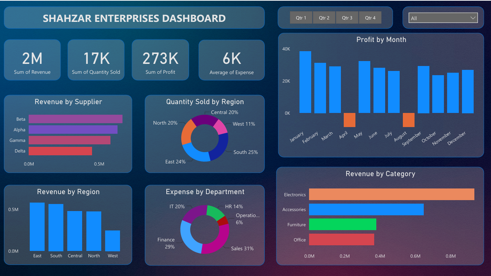

# Shahzar | SQL-to-BI: End-to-End Sales & Finance Analytics

An end-to-end data analytics project that simulates a real-world business reporting environment — from relational database design in SQL through to an interactive business intelligence dashboard in Power BI.

Built as a foundational analytics project for **Shahzar**.

---

## 📌 Project Overview

Most analytics projects show only the final dashboard. This project documents the **entire pipeline**, demonstrating the skills involved at every stage:

1. **Database Design** — modeling a normalized relational schema in MySQL
2. **Data Querying** — writing SQL to join, aggregate, and extract business metrics
3. **Dashboard Development** — transforming query results into an interactive Power BI report
4. **Analysis & Interaction** — using slicers, filters, and KPIs to explore performance in real time

The goal was to replicate how a real company might track sales performance, departmental expenses, and profitability across regions, product categories, and time — using nothing but raw transactional data as the starting point.

---

## 🗄️ Database Design (SQL)

The database (`PowerBI_SQL_Data`) was designed in MySQL Workbench as a normalized relational schema with six core tables, connected through primary and foreign key relationships:

| Table | Description |
|---|---|
| `CustomerData` | Customer records — name, region, segment, contact info |
| `ProductData` | Product catalog — category, price, supplier |
| `EmployeeData` | Employee records, linked to their department |
| `DepartmentData` | Department reference table (Sales, Finance, HR, IT, Operations) |
| `SalesData` | Transaction-level sales — links customer, product, and employee per sale |
| `FinancialData` | Departmental expense records by category and date |

**Entity Relationship Diagram:**


`SalesData` sits at the center of the schema, linking customers, products, and employees for every transaction, while `FinancialData` ties departmental expenses back to the organizational structure — enabling both revenue-side and cost-side analysis from the same model.

### Example Query

The query below powers the dashboard's month-over-month profit trend, joining aggregated revenue and expense figures by month:

```sql
SELECT
    Revenue.Month,
    Revenue.TotalRevenue,
    Expense.TotalExpense,
    Revenue.TotalRevenue - Expense.TotalExpense AS Profit
FROM
    (
        SELECT
            MONTH(SaleDate) AS Month,
            SUM(TotalSale) AS TotalRevenue
        FROM SalesData
        GROUP BY MONTH(SaleDate)
    ) Revenue
JOIN
    (
        SELECT
            MONTH(ExpenseDate) AS Month,
            SUM(Amount) AS TotalExpense
        FROM FinancialData
        GROUP BY MONTH(ExpenseDate)
    ) Expense
ON Revenue.Month = Expense.Month
ORDER BY Revenue.Month;
```

The full schema, table creation statements, sample data, and additional queries are available in [`PBI_Project_Data_SQL.sql`](PBI_Project_Data_SQL.sql).

---

## 📊 Dashboard (Power BI)

The query results were loaded into Power BI and modeled into a single interactive dashboard page covering revenue, profit, expense, and volume performance.



**Key features:**

- **KPI Cards** — Sum of Revenue, Sum of Quantity Sold, Sum of Profit, Average Expense
- **Profit by Month** — column chart highlighting monthly profit, with loss months flagged in a distinct color
- **Revenue by Category / Supplier / Region** — bar charts breaking down where revenue is generated
- **Quantity Sold by Region** and **Expense by Department** — donut charts for proportional comparisons
- **Interactive Slicers** — filter the entire report by quarter (Qtr 1–4) and by region (Central, East, North, South, West), with all visuals updating in real time

This structure allows a viewer to move from a high-level KPI summary down to specific regional or departmental drivers of performance without leaving a single screen.

---

## 🎥 Demo Video

A full screen-recorded walkthrough — covering the SQL querying process and a live, interactive tour of the Power BI dashboard (slicers, filters, and KPIs in action) — is available here:

**[Watch the video walkthrough]**

https://www.linkedin.com/posts/suhail-anwar-38a429198_sql-powerbi-dataanalytics-ugcPost-7480081672114352128-aWda/?utm_source=share&utm_medium=member_desktop&rcm=ACoAAC5WUNoB31Vtv9oe8jgVac-rn9JNzRb52Yg

---

## 🛠️ Tools & Technologies

- **MySQL Workbench** — relational database design, EER modeling, and SQL querying
- **Power BI Desktop** — data modeling, DAX, and dashboard visualization

---

## 📁 Repository Contents

| File | Description |
|---|---|
| `PBI_Project_Data_SQL.sql` | Full database schema, sample data inserts, and analytical queries |
| `dashboard_1.pbix` | Power BI dashboard file (open in Power BI Desktop) |
| `EER_Diagram.png` | Entity relationship diagram of the database schema |
| `Thumbnail.png` | Dashboard screenshot |
| `README.md` | Project documentation (this file) |

> **Note:** GitHub cannot render `.pbix` files in the browser. To explore the live dashboard, download `dashboard_1.pbix` and open it in [Power BI Desktop](https://www.microsoft.com/en-us/power-platform/products/power-bi/downloads).

---

## 👤 Author

SUHAIL ANWAR
Building **Shahzar** — this project reflects the analytics foundation behind it.

[LinkedIn] www.linkedin.com/in/suhail-anwar-38a429198 

